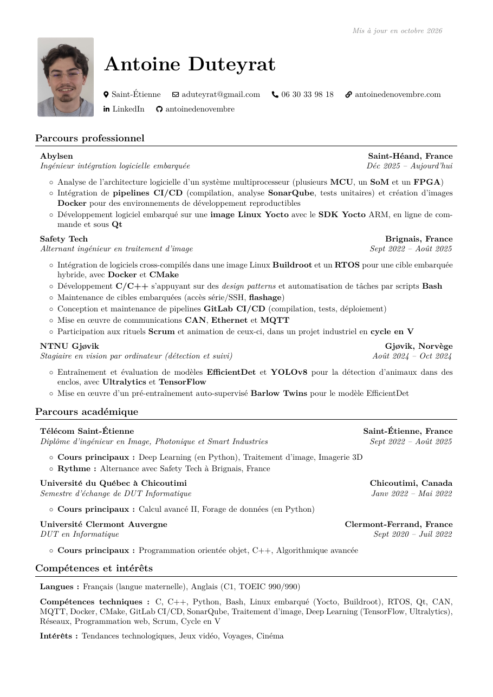
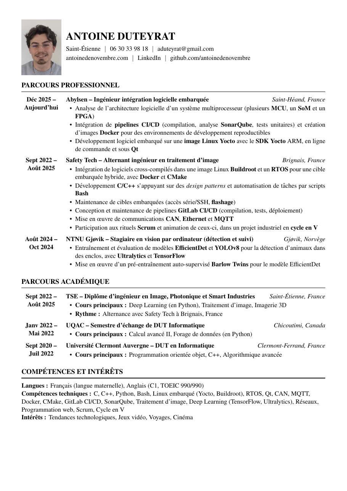
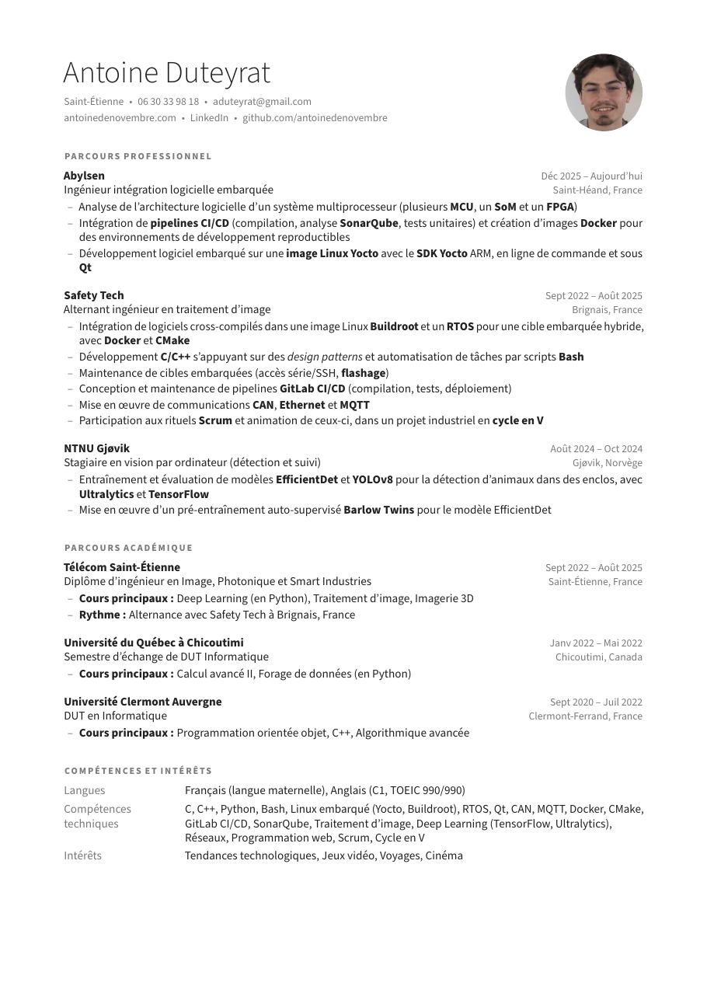
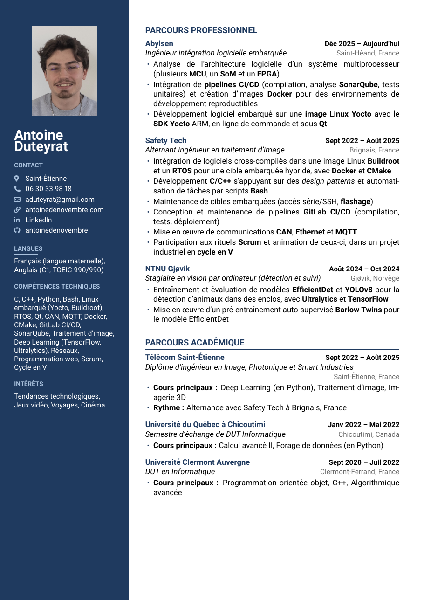
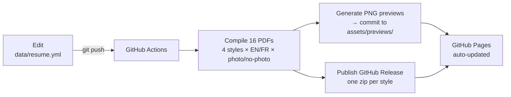

# Resume Repository

A clean, modular LaTeX resume with multilingual support (French & English) and four visual styles, optimized for both human readability and ATS parsing. Automatically compiled with GitHub Actions and updated on every push.

## Quick Access

### Download Latest Resume
- **🇫🇷 French:** [PDF with photo](https://github.com/antoinedenovembre/resume/releases/latest/download/resume_fr.pdf) · [PDF without photo](https://github.com/antoinedenovembre/resume/releases/latest/download/resume-no-image-fr.pdf)
- **🇺🇸 English:** [PDF with photo](https://github.com/antoinedenovembre/resume/releases/latest/download/resume_en.pdf) · [PDF without photo](https://github.com/antoinedenovembre/resume/releases/latest/download/resume-no-image-en.pdf)

### Browse Online
- **Live preview:** [GitHub Pages](https://antoinedenovembre.github.io/resume/)
- **All versions:** [Latest Release](https://github.com/antoinedenovembre/resume/releases/latest)

### Download a style (zip with the 4 variants: with/without photo × FR/EN)
[Default](https://github.com/antoinedenovembre/resume/releases/latest/download/resume-default.zip) · [Tech](https://github.com/antoinedenovembre/resume/releases/latest/download/resume-tech.zip) · [Minimal](https://github.com/antoinedenovembre/resume/releases/latest/download/resume-minimal.zip) · [Sidebar](https://github.com/antoinedenovembre/resume/releases/latest/download/resume-sidebar.zip)

## Editing on Mobile (or anywhere)

Resume content is stored as a single YAML file — no LaTeX knowledge required for everyday edits.

### Edit content
Open this file on GitHub (web or mobile app) and edit directly:
- [`data/resume.yml`](data/resume.yml) — All resume content (both English and French)

The file has `en:` and `fr:` top-level sections. Just update both sections with your changes, commit, and GitHub Actions will compile and publish the updated PDFs automatically.

Use `**bold text**` for bold and `_italic text_` for italic.

### Manual rebuild (without editing)
Go to **[Actions → Compile Resume](../../actions/workflows/compile.yml)** and click **Run workflow** to trigger a fresh build without changing any file. This works from the GitHub mobile app too.

## Styles

Every style is generated from the same `data/resume.yml`, in 4 variants (with/without photo × FR/EN). Previews below: French, with photo.

| Default | Tech |
|:---:|:---:|
|  |  |
| Original layout, icons, blue accents | Times font, ruled uppercase sections, date column on the left |

| Minimal | Sidebar |
|:---:|:---:|
|  |  |
| One airy column, sans-serif, gray letter-spaced titles | Colored left column with photo, contacts and skills |

## How it works

```mermaid
flowchart LR
    A["Edit\ndata/resume.yml"] -->|git push| B["GitHub Actions"]
    B --> C["Compile 16 PDFs\n4 styles × EN/FR × photo/no-photo"]
    C --> D["Generate PNG previews\n→ commit to assets/previews/"]
    C --> E["Publish GitHub Release\none zip per style"]
    D --> F["GitHub Pages\nauto-updated"]
    E --> F
```

## For Developers

Want to customize this resume template or understand how it works?

**[See Development Guide](DEVELOPMENT.md)** for detailed documentation.

## Contact

For any questions about this resume or potential opportunities, please reach out through the contact information provided in the resume PDFs.

## License

This project is licensed under the MIT License - see the [LICENSE](LICENSE) file for details.

---

*🤖 This repository uses GitHub Actions for automated LaTeX compilation and release management.*
