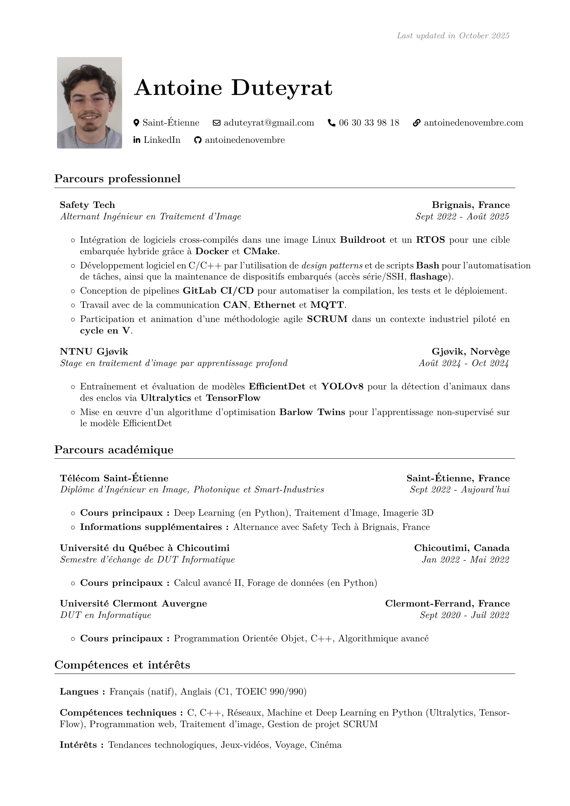

# Resume Repository

A clean, modular LaTeX resume with multilingual support (French & English), optimized for both human readability and ATS parsing. Automatically compiled with GitHub Actions and updated on every push.

## Quick Access

### Download Latest Resume
- **🇫🇷 French:** [PDF with photo](https://github.com/antoinedenovembre/resume/releases/latest/download/resume_fr.pdf) · [PDF without photo](https://github.com/antoinedenovembre/resume/releases/latest/download/resume-no-image-fr.pdf)
- **🇺🇸 English:** [PDF with photo](https://github.com/antoinedenovembre/resume/releases/latest/download/resume_en.pdf) · [PDF without photo](https://github.com/antoinedenovembre/resume/releases/latest/download/resume-no-image-en.pdf)

### Browse Online
- **Live preview:** [GitHub Pages](https://antoinedenovembre.github.io/resume/)
- **All versions:** [Latest Release](https://github.com/antoinedenovembre/resume/releases/latest)

## Preview

  
  

## For Developers

Want to customize this resume template or understand how it works?

**[See Development Guide](DEVELOPMENT.md)** for detailed documentation.

## Contact

For any questions about this resume or potential opportunities, please reach out through the contact information provided in the resume PDFs.

## License

This project is licensed under the MIT License - see the [LICENSE](LICENSE) file for details.

---

*🤖 This repository uses GitHub Actions for automated LaTeX compilation and release management.*
