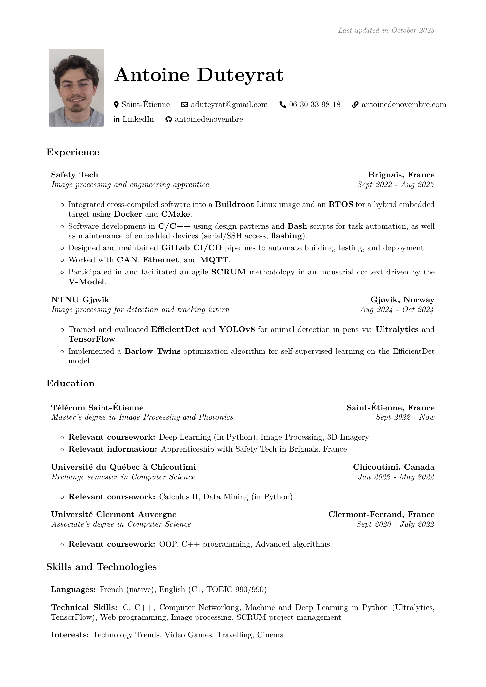

# Resume Repository

[](https://github.com/antoinedenovembre/resume/actions/workflows/compile-resume.yml)
[](../../releases/latest)
[](https://antoinedenovembre.github.io/resume/)

A clean, modular LaTeX resume with multilingual support (French & English), optimized for both human readability and ATS parsing. Automatically compiled with GitHub Actions and updated on every push.

## About
This repository contains my LaTeX resume (FR/EN), compiled automatically with GitHub Actions.
- **Latest PDFs:** [FR](https://github.com/antoinedenovembre/resume/releases/latest/download/resume_fr.pdf) · [EN](https://github.com/antoinedenovembre/resume/releases/latest/download/resume_en.pdf)
- **All versions:** [With/Without Photo - FR/EN](https://github.com/antoinedenovembre/resume/releases/latest) 
- **Live preview (GitHub Pages):** https://antoinedenovembre.github.io/resume/

## Preview

<div align="center">
  
  
</div>

## Resume Versions

The resume is available in **six versions** across **two languages**:

### English Versions
- **Default** (`resume_en.pdf`) - Professional resume with headshot (recommended)
- **With Photo** (`resume-with-image-en.pdf`) - Professional resume including headshot
- **Without Photo** (`resume-no-image-en.pdf`) - Clean resume without personal photo

### French Versions  
- **Default** (`resume_fr.pdf`) - CV professionnel avec photo (recommandé)
- **With Photo** (`resume-with-image-fr.pdf`) - CV professionnel avec photo
- **Without Photo** (`resume-no-image-fr.pdf`) - CV épuré sans photo

## Quick Access

**Latest compiled PDFs are always available here:**
👉 [**Download Latest Resume PDFs**](https://github.com/antoinedenovembre/resume/releases/latest)

## Local Development

### Prerequisites

- LaTeX distribution (TeX Live, MiKTeX, or MacTeX)
- `latexmk` command-line tool

### Building Locally

```bash
# Build all versions in both languages (recommended)
make all

# Build all English versions (with and without photo)
make en

# Build all French versions (with and without photo)
make fr

# Build specific versions
make with_image          # English with photo
make no_image           # English without photo
make with_image_fr      # French with photo
make no_image_fr        # French without photo

# Clean auxiliary files (keeps PDFs)
make clean

# Clean all generated files including PDFs
make clean-all
```

### Development Notes
- All source files are organized in the `src/` directory
- Built PDFs are generated in the `build/` directory  
- The build process automatically cleans auxiliary LaTeX files
- Modular architecture allows easy customization of individual components
- **Multi-language support**: English and French versions with shared configuration and styling

## Automated Compilation

Every push to the `main` branch automatically:

1. Compiles all resume versions (English and French, with and without photo)
2. Creates a "latest" release with updated PDFs
3. Stores artifacts for 30 days
4. Provides immediate access to latest versions

## Project Structure

<details>
<summary>📁 Project Structure</summary>
```
resume/
├── .github/workflows/
│   └── compile-resume.yml      # CI/CD pipeline for automated builds
├── assets/
│   └── photo.jpg              # Profile photo asset
├── build/
│   ├── resume_with_image_en.tex       # Main LaTeX file with photo (EN)
│   ├── resume_no_image_en.tex         # Main LaTeX file without photo (EN)
│   ├── resume_with_image_fr.tex    # Main LaTeX file with photo (FR)
│   ├── resume_no_image_fr.tex      # Main LaTeX file without photo (FR)
├── src/
│   ├── config/
│   │   ├── packages.tex        # LaTeX package imports and configuration
│   │   ├── style.tex           # Styling definitions and formatting
│   │   └── commands.tex        # Custom LaTeX commands
│   ├── content/
│   │   ├── resume_content.tex  # Main resume content (English)
│   │   └── resume_content_fr.tex # Main resume content (French)
│   └── layout/
│       ├── header_with_image.tex    # Header layout with photo (EN)
│       ├── header_no_image.tex      # Header layout without photo (EN)
│       ├── header_with_image_fr.tex # Header layout with photo (FR)
│       └── header_no_image_fr.tex   # Header layout without photo (FR)
├── Makefile                   # Build automation
├── .gitignore                 # Git ignore rules
└── README.md                  # This file
```
</details>

## Modular Architecture

The project uses a modular LaTeX architecture for better maintainability:

- **Configuration Layer** (`src/config/`): Package imports, styling, and custom commands (shared across languages)
- **Content Layer** (`src/content/`): Actual resume content with separate files per language
- **Layout Layer** (`src/layout/`): Different header layouts for photo variants and languages
- **Build Layer** (`build/`): Main document files that combine all modules for each version
- **Assets** (`assets/`): Static resources like photos

### Multi-language Support

- **Shared Configuration**: All languages use the same packages, styles, and commands
- **Language-specific Content**: Separate content files for each language (`resume_content_en.tex` and `resume_content_fr.tex`)
- **Language-specific Headers**: Header files adapted for each language while maintaining the same styling
- **Consistent Build System**: Simple `make en` and `make fr` commands to build all versions for each language

## Versioning

- **Latest Release**: Always contains the most recent compiled PDFs
- **Tagged Releases**: Create a git tag (e.g., `v1.0`) to create a permanent versioned release

```bash
# Create a versioned release
git tag v1.0
git push origin v1.0
```

## LaTeX Packages Used

### Core Packages
- `geometry` - Page layout and margins configuration
- `titlesec` - Section title customization
- `tabularx` & `array` - Advanced table formatting
- `xcolor` - Color definitions and primary color scheme
- `enumitem` - List customization and styling
- `fontawesome5` - Professional icons integration
- `hyperref` & `bookmark` - PDF metadata, links, and navigation

### Layout & Formatting
- `amsmath` - Mathematical expressions support
- `eso-pic` - Floating text positioning
- `calc` - Length calculations
- `lastpage` - Total page count reference
- `changepage` - Adjustable width environments
- `paracol` - Multi-column layout support
- `needspace` - Intelligent page break management

### Conditional Packages (Photo Version Only)
- `graphicx` - Image inclusion for profile photo
- `tikz` - Graphics and diagrams creation

### Engine Compatibility
- `iftex` - LaTeX engine detection
- `ifthen` - Conditional statements
- PDF/A compatibility packages for ATS parsing

## Advanced Features

### Conditional Compilation
The project uses intelligent conditional compilation:
- Photo-related packages (`graphicx`, `tikz`) are only loaded for the image version
- Keeps the no-image version lightweight and faster to compile
- Maintains ATS (Applicant Tracking System) compatibility

### PDF Optimization
- Machine-readable PDF generation for ATS parsing
- Unicode character mapping for text extraction
- Proper PDF metadata and navigation bookmarks
- Color-coded links with professional styling

### Build System
- Automated cleanup of auxiliary LaTeX files
- Parallel compilation support via Makefile
- Consistent output in `build/` directory
- Development-friendly with modular source organization

## Contact

For any questions about this resume or potential opportunities, please reach out through the contact information provided in the resume PDFs.

## Changelog

See the [CHANGELOG.md](CHANGELOG.md) for detailed changes and updates to this repository.

## License

This project is licensed under the MIT License - see the [LICENSE](LICENSE) file for details.

---

*This repository uses GitHub Actions for automated LaTeX compilation and release management.*  
*Last updated: August 2025 - Modular architecture implementation*